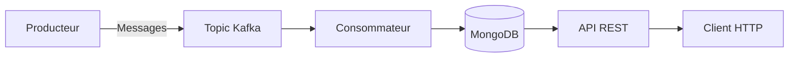

# TP6 : Intégration et Manipulation de Données avec Kafka
Ce TP vise à acquérir des compétences pratiques dans la gestion des flux de données avec Apache Kafka et à apprendre à intégrer Kafka avec des applications Node.js pour la production et la consommation de messages. L'objectif final est de créer un système complet qui :
1. Produit des messages vers un topic Kafka
2. Consomme ces messages et les stocke dans une base de données MongoDB
3. Expose une API REST pour récupérer les messages stockés
##  Prérequis
### Pour Windows
- Java JDK 8+ (nécessaire pour Kafka)
- Node.js 16+
- MongoDB Community Edition [Télécharger](https://www.mongodb.com/try/download/community)
- Kafka 3.9.0 [Télécharger](https://kafka.apache.org/downloads)

## Configuration et démarrage des services
### 1. Démarrer Zookeeper
```powershell
# (terminal 1)
bin\windows\zookeeper-server-start.bat config\zookeeper.properties
```
### 2. Démarrer Kafka
```powershell
# (terminal 2)
bin\windows\kafka-server-start.bat config\server.properties
```
### 3. Créer un topic Kafka
```powershell
# Créer un topic
bin\windows\kafka-topics.bat --create --topic test-topic --bootstrap-server localhost:9092
```
### 4. Démarrer MongoDB
Assurez-vous que MongoDB est en cours d'exécution. Par défaut, il écoute sur mongodb://localhost:27017.

## Installation 
### 1. Cloner le dépôt ou créer un nouveau dossier pour le projet
### 2. Installer les dépendances :
```powershell
npm init -y
npm install express mongoose kafkajs
```
## Structure de projet
```
TP6-Kafka/
├── producer.js       # Producteur Kafka (envoie des messages)
├── consumer.js       # Consommateur Kafka (stocke dans MongoDB)
├── api.js            # API Express (accès aux données)
├── README.md         # Docummentation
└── package.json      # Dépendances Node.js
```
## Flux de données

1. Le producteur envoie un message "Hello KafkaJS user!" au topic test-topic toutes les secondes
2. Le consommateur, abonné à ce topic, reçoit chaque message
3. Pour chaque message reçu, le consommateur :
- Convertit le message en chaîne de caractères
- Crée un nouveau document MongoDB avec le contenu du message
- Enregistre le document dans la collection "messages" de la base de données "kafkaDB"
4. L'API REST expose un endpoint GET /messages qui :
- Récupère tous les messages de la base de données
- Les trie par date de création décroissante
- Renvoie les messages au format JSON

## Exécution du système
### 1. Démarrer le producteur
```powershell
node producer.js
```
Le producteur enverra un message toutes les secondes au topic Kafka.

### 2. Démarrer le consommateur
```powershell
node consumer.js
```
Le consommateur se connectera à Kafka et commencera à stocker les messages dans MongoDB.

### 3. Démarrer l'API REST
```powershell
node api.js
```
L'API sera disponible sur http://localhost:3000/messages

## Test du système complet
1. Vérifiez que le producteur envoie des messages (logs dans la console)
2. Vérifiez que le consommateur reçoit et stocke les messages (logs dans la console)
3. Interrogez l'API pour voir les messages stockés :

```powershell
curl http://localhost:3000/messages
ou ouvrez cette URL dans un navigateur.
```
